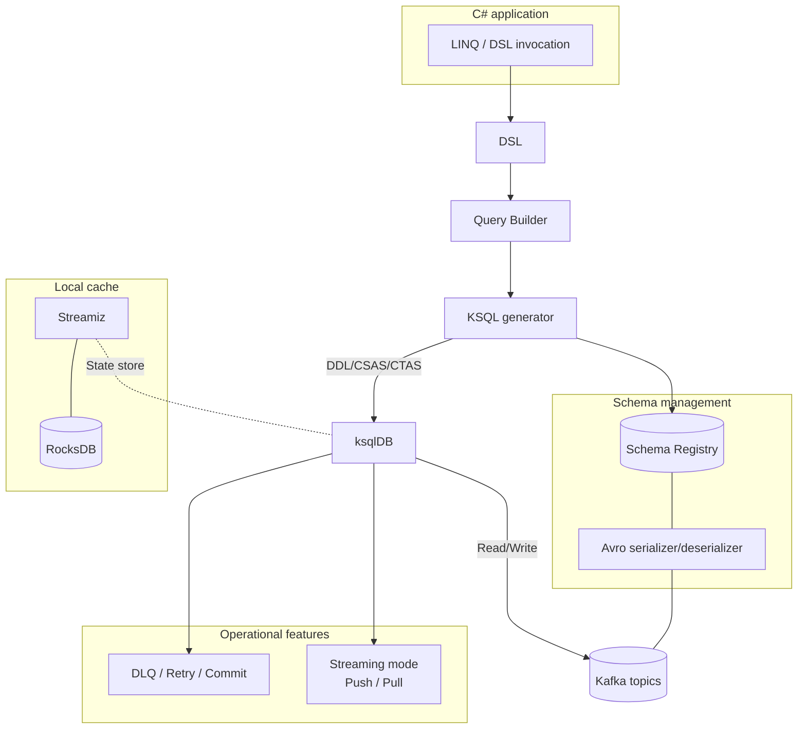

#  &nbsp;
&nbsp; Kafka.Ksql.Linq &nbsp;&nbsp;

> LINQ-style C# DSL for type-safe Kafka/ksqlDB operations.

---

## Overview

Kafka.Ksql.Linq is a C# library that unifies Kafka/ksqlDB and Avro/Schema Registry usage. It lets you control Kafka Streams and ksqlDB in a LINQ style and offers the following capabilities.

- Operate Kafka and ksqlDB through a LINQ-based DSL.
- Design type-safe schemas with Avro and Schema Registry.
- Detect Streams/Tables and Pull/Push modes automatically.
- Support operations with DLQ, retry, and commit helpers.
**Market-schedule–aware OHLC bars (support feature):**
   Generate OHLC bars (e.g., 1s/1m/5m/15m/1h) strictly aligned to exchange trading sessions.
   The engine skips closed hours and holidays, handles DST correctly, and offers gap policies
   (skip, carry-forward close, or emit sentinel). Pre-/post-market can be toggled per schedule.
---

## Quick start

### ✅ Send one message and receive it within 10 seconds

- **Prerequisites**: .NET 8, Kafka, ksqlDB, Schema Registry
- **Install**:

```sh
dotnet add package Kafka.Ksql.Linq
```

- **Code sample**: Send one Hello World message, receive it instantly, and print it.

```csharp
await using var context = new HelloKafkaContext(configuration, LoggerFactory.Create(b => b.AddConsole()));
var message = new HelloMessage
{
    Id = Random.Shared.Next(),
    Text = "Hello World"
};
await context.HelloMessages.AddAsync(message);
await context.HelloMessages.ForEachAsync(m =>
{
    Console.WriteLine($"Received: {m.Text}");
    return Task.CompletedTask;
});
```

---

## Architecture snapshot

The diagram below shows how Kafka.Ksql.Linq connects to your Kafka environment and processes data.

### End-to-end architecture



---

## 📘 Examples

Review the representative samples below. Every example is cataloged in [`docs/examples/index.md`](docs/examples/index.md).

- Basics: `AddAsync` / `ForEachAsync`
- Query basics: LINQ-to-KSQL conversion samples
- Windowing: time windows and aggregations
- Error handling: DLQ / Retry / Commit
- OnModelCreating: [`docs/onmodelcreating_samples.md`](docs/onmodelcreating_samples.md)

---

## 📚 Documentation

### 👩‍💻 User guides

- SQL Server to Kafka: [`sqlserver-to-kafka-guide.md`](docs/sqlserver-to-kafka-guide.md)
- API reference: [`api_reference.md`](docs/api_reference.md)
- Configuration guide: [`configuration_reference.md`](docs/configuration_reference.md)

### ⚙️ Under the hood

- Extension rules and design intent: [`advanced_rules.md`](docs/advanced_rules.md)

---

## 🧭 License and roadmap

- License: [MIT License](./LICENSE)
- Documentation: portions will adopt [CC BY 4.0](https://creativecommons.org/licenses/by/4.0/)
- Planned work (examples):
  - Expand examples
  - Prepare for .NET 10 support

---

## 🤝 Acknowledgements

This library was built under the theme of "AI and human co-creation" with support from the Amagi, Naruse, Shion, Kyouka, Kusunoki, Jinto, Hiromu, and Hazuki AI agents. See [Acknowledgements.md](./docs/acknowledgements.md) for details.

---

