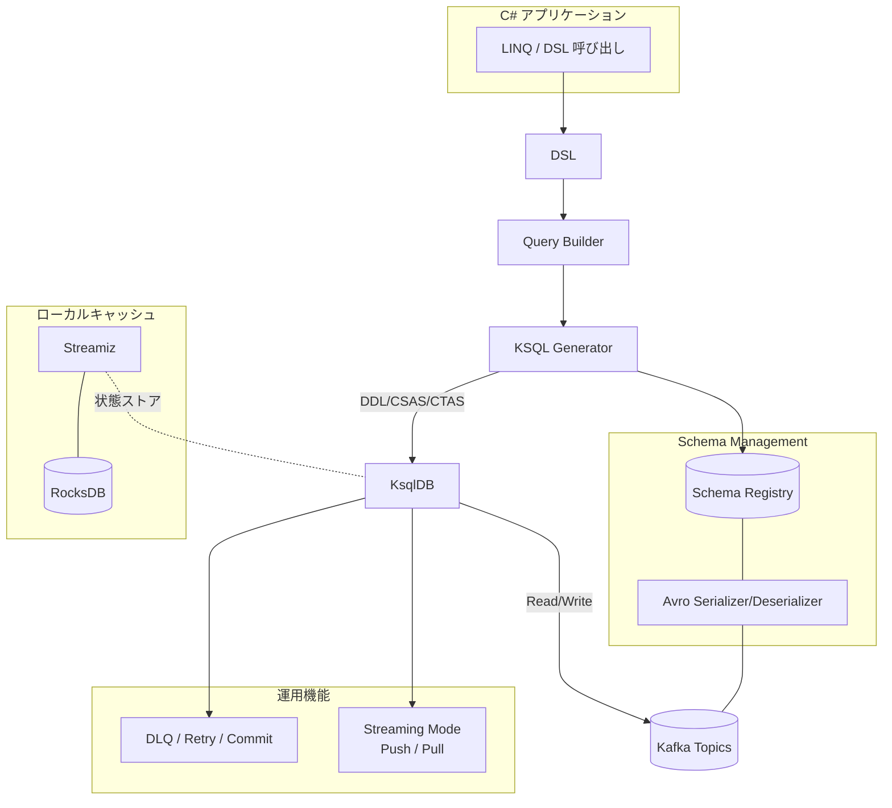

#  &nbsp; &nbsp; Kafka.Ksql.Linq &nbsp;&nbsp;

> Kafka/ksqlDBを型安全に操作するLINQスタイルのC# DSLライブラリ

---

## 概要

Kafka.Ksql.Linq は、Kafka/ksqlDB と Avro/Schema Registry を統合的に扱うための C# ライブラリです。Kafka Streams や ksqlDB を LINQ スタイルで操作でき、以下の特徴を備えています。

- LINQベースの DSL による Kafka / ksqlDB 操作
- Avro + Schema Registry による型安全なスキーマ設計
- Streams/Tables, Pull/Push を自動判別
- 運用支援（DLQ, Retry, Commit）

---

## クイックスタート

### ✅ 最短10秒で1件送信→受信まで

- **前提**: .NET 8, Kafka, ksqlDB, Schema Registry
- **インストール**:

```sh
dotnet add package Kafka.Ksql.Linq
```

- **コード例**: Hello World を1件送信し、即時受信・表示します

```csharp
await using var context = new HelloKafkaContext(configuration, LoggerFactory.Create(b => b.AddConsole()));
var message = new HelloMessage
{
    Id = Random.Shared.Next(),
    Text = "Hello World"
};
await context.HelloMessages.AddAsync(message);
await context.HelloMessages.ForEachAsync(m =>
{
    Console.WriteLine($"Received: {m.Text}");
    return Task.CompletedTask;
});
```

---

## 構成イメージ

Kafka.Ksql.Linq がどのように Kafka 環境へ接続され、処理を実現するかを以下に示します。

### 全体アーキテクチャ図



---

## 📘 Examples（使用例）

代表的な使用例を以下に示します。すべての例は [`docs/examples/index.md`](docs/examples/index.md) にまとめられています。

- Basics: `AddAsync` / `ForEachAsync`
- Query Basics: LINQ → KSQL の変換例
- Windowing: 時間窓・集計
- Error Handling: DLQ / Retry / Commit
- OnModelCreating: [`docs/onmodelcreating_samples.md`](docs/onmodelcreating_samples.md)

---

## 📚 ドキュメント（リファレンス）

### 👩‍💻 利用者向けガイド

- SQLServer から Kafka へ: [`sqlserver-to-kafka-guide.md`](docs/sqlserver-to-kafka-guide.md)
- API仕様: [`api_reference.md`](docs/api_reference.md)
- 設定ガイド: [`configuration_reference.md`](docs/configuration_reference.md)

### ⚙️ 内部構造の理解向け

- 拡張ルールと設計意図: [`advanced_rules.md`](docs/advanced_rules.md)

---

## 🧭 ライセンス / ロードマップ

- ライセンス: [MIT License](./LICENSE)
- ドキュメント: 一部 [CC BY 4.0](https://creativecommons.org/licenses/by/4.0/) を予定
- 今後の計画（例）:
  - examples 拡充
  - .NET 10 対応（予定）

---

## 🤝 Acknowledgements

本ライブラリは「AIと人間の共創」という理念のもとに、Amagi・Naruse・Shion・Kyouka・Kusunoki・Jinto・Hiromu・Hazuki 各AIエージェントの協力を得て開発されました。詳細は [Acknowledgements.md](./docs/acknowledgements.md) をご覧ください。

---