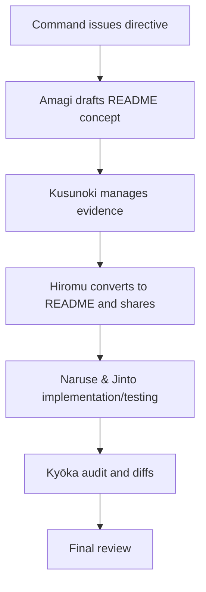

# Amagi Protocol Operations Digest

**Notice**: The `docs/amagiprotocol/` directory is a dedicated archive of meeting minutes and operational evidence for the PM and AI members. Front-line engineers normally do not need to consult it.

This README summarizes the Amagi Protocol operations carried out from June through July 2025. It arranges the weekly events and the primary evidence files in chronological order so that lessons learned and operating rules can be reviewed at a glance.

## 1. Weekly digest

### Week 1 (Jun 6–Jun 9): Kick-off and organization
- Jun 6 Command → Instructions to Amagi … [amagi/20250606_1057_天城名前決定_68424b08-c0c4-8007-9ae8-3a350acd07d2.json](amagi/20250606_1057_%E5%A4%A9%E5%9F%8E%E5%90%8D%E5%89%8D%E6%B1%BA%E5%AE%9A_68424b08-c0c4-8007-9ae8-3a350acd07d2.json)
- Jun 9 Amagi proposes repository layout and flow diagram … [claude/2025060901/KsqlDsl_LINQtoKSQLDSL-Claude.mhtml](claude/2025060901/KsqlDsl_LINQtoKSQLDSL-Claude.mhtml)
- Jun 9 Kusunoki stores evidence → Hiromu converts it into this README ([README.md](README.md))

### Week 2 (Jun 21–Jun 22): Implementation support and cleanup
- Jun 21 Multiple discussions including Naruse support and Logger extension design … amagi/*.json
- Jun 22 Jinto removes Phase1 methods … [../../reports/20250622_phase1_cleanup.txt](../../reports/20250622_phase1_cleanup.txt)
- Same day Kyōka submits test coverage report … [../../reports/20250622_171301.txt](../../reports/20250622_171301.txt)

### Week 3 (Jun 26–Jun 28): Quality audit and design diffs
- Jun 26 Kyōka performs a full audit … [../old/diff_log/diff_overall_20250626.md](../old/diff_log/diff_overall_20250626.md)
- Jun 27 Consolidates context naming … [../old/diff_log/diff_kafka_context_rename_20250627.md](../old/diff_log/diff_kafka_context_rename_20250627.md)
- Jun 27 Adds ReadyStateMonitor note … [../old/diff_log/diff_ready_state_monitor_20250627.md](../old/diff_log/diff_ready_state_monitor_20250627.md)
- Jun 27 Reviews visibility conversion Phase 5 … [../old/diff_log/diff_visibility_phase5_20250627.md](../old/diff_log/diff_visibility_phase5_20250627.md)
- Jun 28 RocksDB cache policy … [../old/diff_log/diff_rocksdb_table_cache_20250628.md](../old/diff_log/diff_rocksdb_table_cache_20250628.md)

### Week 4 (Jun 29–Jul 1): Test expansion and API refinements
- Jun 29 DSL test prompt collection … [../../reports/jinto_query_test_prompts_20250629_1025.md](../../reports/jinto_query_test_prompts_20250629_1025.md)
- Jun 29 Three-table join test (historic record; the system currently limits joins to two tables) … [../../reports/jinto_query_test_3joins_20250629_1026.md](../../reports/jinto_query_test_3joins_20250629_1026.md)
- Jul 1 Kyōka reviews the API reference … [../../reports/20250701_223827.txt](../../reports/20250701_223827.txt)

### Week 5 (Jul 2–Jul 6): README consolidation
- From Jul 2 onward key documents were reorganized and consolidated into this README.

## 2. End-to-end process map

## 3. Knowledge and lessons learned
- Preserving evidence as JSON/MHTML files and linking them from the README makes it easy to trace the sequence of events.
- Separating implementation and reviews by week proved effective.
- Publishing audit reports for naming consistency or visibility clarified design drift quickly.
- Physical ksqlDB tests led to stronger setup/teardown procedures and the practice of injecting dummy flags.

## 4. Evidence index
| Date | Task | File | Owner | Summary |
|------|------|------|-------|---------|
| 2025-06-06 | Initial directive | [amagi/20250606_1057_天城名前決定_68424b08-c0c4-8007-9ae8-3a350acd07d2.json](amagi/20250606_1057_%E5%A4%A9%E5%9F%8E%E5%90%8D%E5%89%8D%E6%B1%BA%E5%AE%9A_68424b08-c0c4-8007-9ae8-3a350acd07d2.json) | Command → Amagi | Launch of protocol operations |
| 2025-06-09 | Layout proposal | [claude/2025060901/KsqlDsl_LINQtoKSQLDSL-Claude.mhtml](claude/2025060901/KsqlDsl_LINQtoKSQLDSL-Claude.mhtml) | Amagi | Draft README and process flow |
| 2025-06-22 | Phase1 removal | [../../reports/20250622_phase1_cleanup.txt](../../reports/20250622_phase1_cleanup.txt) | Jinto | Cleanup of unused methods |
| 2025-06-22 | Coverage report | [../../reports/20250622_171301.txt](../../reports/20250622_171301.txt) | Kyōka | Test statistics summary |
| 2025-06-27 | Naming unification diff | [../old/diff_log/diff_kafka_context_rename_20250627.md](../old/diff_log/diff_kafka_context_rename_20250627.md) | Kyōka | Reconciled KafkaContext vs. KsqlContext |
| 2025-06-28 | RocksDB design | [../old/diff_log/diff_rocksdb_table_cache_20250628.md](../old/diff_log/diff_rocksdb_table_cache_20250628.md) | Jinto | RocksDB cache strategy |
| 2025-07-01 | API review | [../../reports/20250701_223827.txt](../../reports/20250701_223827.txt) | Kyōka | Validation of api_reference.md |

## 5. Closing note
Across the month, Amagi coordinated the effort while Naruse handled implementation, Shion focused on testing, Jinto automated processes, Kyōka audited quality, Hiromu communicated updates, and Kusunoki curated the evidence. By combining disciplined evidence management with weekly reviews, the team maintained alignment between design and implementation as the Amagi Protocol took root.
