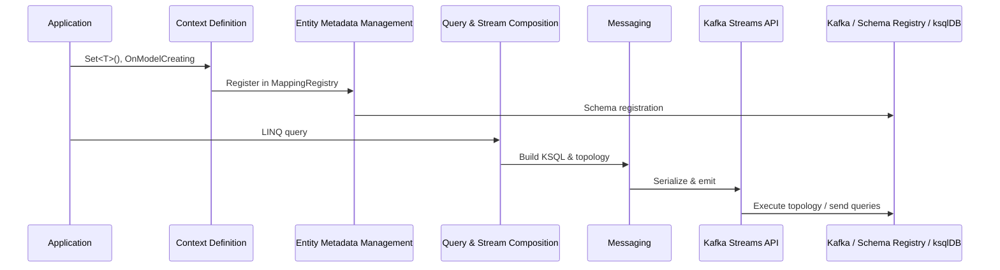

## 🏗️ Architecture Overview (Layers and Responsibilities)

This document is an **internal design reference** for the Kafka.Ksql.Linq OSS. It clarifies the overall architecture and the responsibilities of each layer.

⚠️ It targets contributors who modify or extend the OSS itself. It is not a user-facing DSL overview.

---

### 🗂️ Layer list
1. Application layer
2. Context definition layer
3. Entity metadata management layer
4. Query and stream composition layer
5. Messaging layer
6. Kafka Streams API layer
7. Kafka / Schema Registry / ksqlDB platform layer

### 📊 Layer diagram
```mermaid
graph TB
    A[Application\nSet<T>() and OnModelCreating] --> B[Context Definition\nKsqlContext & KsqlModelBuilder\nMappingRegistry]
    B --> C[Entity Metadata Management\nMappingRegistry]
    C --> D[Query & Stream Composition\nLINQ→KSQL, KStream/KTable]
    D --> E[Messaging\nSerialization, DLQ]
    E --> F[Kafka Streams API]
    F --> G[Kafka / Schema Registry / ksqlDB]
```

### 🧱 Layer responsibilities
| Layer | Primary responsibilities | Representative namespaces / classes |
|-------|-------------------------|-------------------------------------|
| Application layer | DSL usage (`KsqlContext` inheritance + `OnModelCreating` + `Set<T>()`) | `samples`, `src/Application` |
| Context definition layer | DSL parsing and model construction (`KsqlContext`, `KsqlModelBuilder`, `MappingRegistry`) | `src/Core` |
| Entity metadata management layer | Analyze POCO attributes and manage Kafka/Schema Registry settings via `MappingRegistry` | `src/Mapping` |
| Query & stream composition layer | Parse LINQ, generate KSQL, build KStream/KTable topologies, handle windows, joins, finals | `src/Query`, `src/EventSet` |
| Messaging layer | Serialize/deserialize messages, interface with DLQ, bridge to Kafka Streams | `src/Messaging` |
| Kafka Streams API layer | Execute Kafka Streams topologies, send queries to ksqlDB | Streamiz.Kafka.Net |
| Kafka / Schema Registry / ksqlDB platform layer | Cluster operations, schema management, KSQL runtime | Kafka, Schema Registry, ksqlDB |

### 🔄 Typical flow across layers
The sequence below shows a representative path from `Set<T>()` registration to the Kafka platform.



Layer-specific structure and key classes are documented under `docs/namespaces/`.

---

### 🔁 Related documents
- `docs_configuration_reference.md`: appsettings ↔ DSL mapping
- `docs_advanced_rules.md`: operational constraints and design rationale
- `dev_guide.md`: implementation rules for extending the DSL or adding features
- `docs/namespaces/*.md`: responsibilities and extension points per namespace

This overview supports structural understanding and acts as the starting index when extending the system. Diagrams and dependency maps will be added separately.

---

## POCO design, primary keys, and serialization policy

This section summarizes how the OSS handles POCO design, key management, and serialization/deserialization. It is based on [reports/20250708.txt](../reports/20250708.txt) and was organized by Hiromu with review from Kyōka and Kusunoki. `MappingRegistry` applies these rules automatically when you register entities through `Set<T>()`.

### 1. POCO design principles
- Business POCOs remain **pure business data structures**; do not attach key-related attributes.
- Design them freely without worrying about Kafka key schema.

### 2. Primary-key rules
- Key schema is derived purely from the **property declaration order** in the DTO/POCO.
- Remove `Key` attributes; composite-key order follows the DTO property order.
- Allowed key types: `int`, `long`, `string`, `Guid`. Convert others at the application level.
- Align the key order with logical keys used in LINQ (`group by`, etc.).
- If the key order from `GroupBy`/`Join` differs from the DTO property order, initialization throws `InvalidOperationException` with the message **"GroupBy key order must match the output DTO property order."**

### 3. Serialization / deserialization policy
- POCO ↔ key/value struct conversions are fully automated.
- Produce: automatically split DTOs into key and value parts and serialize them.
- Consume: deserialize Kafka key/value pairs and reconstruct the DTO/POCO.
- Cache serializers/deserializers per type/schema for performance.

### 4. Operational notes
- Document these policies across all guides and ensure the whole team follows them.
- Escalate progress or issues to Amagi (PM) as needed.

Prepared by Hiromu / Reviewed by Kyōka & Kusunoki

### Related documents
- [getting-started.md](./getting-started.md)
- [docs_advanced_rules.md](./docs_advanced_rules.md)
- [Story: From Set<T>() to Messaging](./architecture/entityset_to_messaging_story.md)
- [Key-Value Flow Architecture (POCO ↔ Kafka)](./architecture/key_value_flow.md)
- [Query → KsqlContext → Mapping/Serialization Flow](./architecture/query_ksql_mapping_flow.md)
- [Query to AddAsync Flow Sample](./architecture/query_to_addasync_sample.md)
