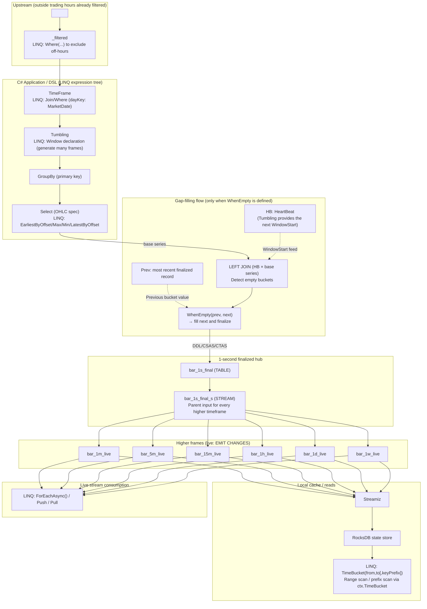

This document explains the bar-generation DSL from "What it can do" → "How it works" → "Operational cautions" so you can grasp the full picture quickly.

Capabilities
- Generate bars (candles) of second/minute/hour/day/week/month from ticks (rates or trades).
- Declare multiple time frames (for example 1m/5m/1h/1d) in a single query.
- Stabilize day/week boundaries by joining a MarketSchedule (business calendar).
- Materialize tables into RocksDB via Streamiz and fetch them quickly with `ToListAsync()`.

---

## 1. Big picture (read this first)

Processing flow (top to bottom)
- Input: stream that already excludes off-hours (for example `<raw>_filtered`).
- Schedule join: `TimeFrame<MarketSchedule>(…, dayKey: …)` filters to trading hours and fixes day/week boundaries.
- Window generation: `Tumbling(r => r.Timestamp, Windows { … }, grace: …)` creates multiple bars at once.
- Aggregation: whatever you place inside `GroupBy(...).Select(...)` becomes the specification (for example OHLC).
- Gap fill (optional): only add `WhenEmpty` when you need dense sequences.
- Output: runtime profiles decide the physical topics/tables for live/final (not exposed in the DSL).

Assumptions
- Every higher timeframe fans out **directly** from `1s_final`; no multi-hop rollups such as 5m → 15m.
- Grace increases stepwise by "parent + 1 second" so late-arriving ticks are captured.
- Tables are materialized through Streamiz into RocksDB; `ToListAsync()` reads from there.

Minimal declaration order (must be followed)
- `From` → `TimeFrame` → `Tumbling` → `GroupBy` → `Select` → (optional) `WhenEmpty`

Why this order matters
- `TimeFrame()` narrows the stream to trading hours and anchors the boundaries; `Tumbling()` places the windows afterward.
- `Tumbling()` defines the bucket start (`WindowStart`). `GroupBy()/Select()` specify OHLC and other metrics.

Key points
- `From`: specify the input stream entity (for example `DedupRateRecord`).
- `TimeFrame`: use only when you need trading-hour restrictions. Add `dayKey` for day-or-longer bars.
- `Tumbling`: declare minutes/hours/days/months together.
- `GroupBy`: list the primary key (for example `Broker`, `Symbol`).
- `Select`: this block is the specification itself; nothing is hard-coded elsewhere.
- `WhenEmpty`: only add when you need to fill gaps.
  - Note: when using `WhenEmpty`/Prev/Fill, include `WindowStart()` exactly once inside `Select` (bucket column required).



## 2. Detailed behavior (dig in here)

### 2.1 TimeFrame and dayKey (business-day boundaries)
```csharp
.TimeFrame<MarketSchedule>((r, s) =>
       r.Broker == s.Broker
    && r.Symbol == s.Symbol
    && s.Open <= r.Timestamp && r.Timestamp < s.Close,
    dayKey: s => s.MarketDate)
```
Operational tips
- Evaluate schedule checks upstream (for example produce `<raw>_filtered` first).
- `dayKey` stabilizes day/week/month boundaries. It is optional for minute/hour bars.

### 2.2 TimeFrame and Tumbling (declare multiple bars together)
```csharp
q.From<DedupRateRecord>()
 .TimeFrame<MarketSchedule>((r, s) =>
        r.Broker == s.Broker
     && r.Symbol == s.Symbol
     && s.OpenTime <= r.Ts && r.Ts < s.CloseTime)
 .Tumbling(r => r.Ts,
     new Windows {
         Minutes = new[]{ 5, 15, 30 },
         Hours   = new[]{ 1, 4, 8 },
         Days    = new[]{ 1, 7 },
         Months  = new[]{ 1, 12 }
     },
     grace: TimeSpan.FromMinutes(2))
```
When to use
- Declare many frames in one go.
- Grace is interpreted by the runtime; internally it propagates as "parent + 1 second".
- Intermediate frames and base units are internal; users never see them.

### 2.3 GroupBy (primary key)
```csharp
.GroupBy(r => new { r.Broker, r.Symbol })
```
Concept
- The GroupBy key plus the bucket column (`WindowStart`) form the primary key.

### 2.4 GroupBy + Select (projection = specification)
```csharp
q.From<DedupRateRecord>()
 .TimeFrame<MarketSchedule>((r, s) => r.Broker == s.Broker && r.Symbol == s.Symbol && s.OpenTime <= r.Ts && r.Ts < s.CloseTime)
 .Tumbling(r => r.Ts, new Windows { Minutes = new[]{ 1 } })
 .GroupBy(r => new { r.Broker, r.Symbol })
 .Select(g => new OneMinuteCandle {
     Broker   = g.Key.Broker,
     Symbol   = g.Key.Symbol,
     BarStart = g.WindowStart(),            // bucket column (detected by expression; column name is free)
     Open  = g.EarliestByOffset(x => x.Bid),
     High  = g.Max(x => x.Bid),
     Low   = g.Min(x => x.Bid),
     Close = g.LatestByOffset(x => x.Bid)
 })
```
Notes
- Always project `g.WindowStart()` exactly once. Name is irrelevant; the analyzer looks at the expression.
- OHLC definitions live entirely in your code; nothing is hard-coded elsewhere.
- Derived stages use `SELECT *` (identity projection). Column names follow your DTO.

### 2.5 WhenEmpty (optional gap fill)
```csharp
.WhenEmpty((previous, next) =>
{
    next.Broker = previous.Broker;
    next.Symbol = previous.Symbol;
    next.Open   = previous.Close;
    next.High   = previous.Close;
    next.Low    = previous.Close;
    next.Close  = previous.Close;
    return next;
})
```
Highlights
- When you add `WhenEmpty`, the DSL switches to "continuous mode" (HeartBeat + LEFT JOIN + Fill).
- If you omit it, the series stays sparse.
- Do **not** send gap-filled results back upstream (no cycles).

### 2.6 Table cache and ToListAsync (RocksDB)
- Tables are materialized by Streamiz into RocksDB state stores.
- `ToListAsync()` waits for RUNNING then enumerates the store.
- Prefix filters use NUL-delimited string keys.
- Typical propagation time: 50–200 ms; 0.5–3 s right after startup (environment dependent).
- Streams do not support `ToListAsync()`; use push consumption instead.

---

## 3. Internal assumptions (good to know)
- Every higher frame derives flatly from `1s_final` (no 5m → 15m chains).
- `BaseUnitSeconds` must divide 60; the runtime expands multiples automatically.
- `WindowStart` is identified by the expression, not the column name.
- Execution mode and physical names live in the profile (outside the DSL).
- Gap-fill cycles are forbidden (never feed downstream data back upstream).
- Grace propagates as "parent + 1 second".

---

## 4. Validation (automatic checks)
- `BaseUnitSeconds` must divide 60.
- Window sizes must be multiples of `BaseUnitSeconds` (≥1 minute must be whole minutes).
- Grace must satisfy the "parent + 1 second" rule.
- Common errors:
  - `Base unit must divide 60 seconds.`
  - `Windows ≥ 1 minute must be whole-minute multiples.`
  - `Windowed query requires exactly one WindowStart() in projection.`

---

## 5. Representative scenario (generate many bars at once)
- Declare seconds/minutes/hours/days/months at once with a single `1s_final` hub.
- Add `WhenEmpty` only for series that require gap filling.

---

## 6. 1m → 5m rollup (design & verification)

### 6.1 Design (flat derivation from the same source)
Implementation pattern: `From → TimeFrame (optional) → Tumbling → GroupBy → Select`. Use `Windows` to declare multiple frames.

```csharp
// Example: DedupRateRecord (Ts, Broker, Symbol, Bid)
b.Entity<Candle1m>().ToQuery(q => q
    .From<DedupRateRecord>()
    .Tumbling(r => r.Ts, new Windows { Minutes = new[] { 1 } })
    .GroupBy(r => new { r.Broker, r.Symbol })
    .Select(g => new Candle1m {
        Broker   = g.Key.Broker,
        Symbol   = g.Key.Symbol,
        BarStart = g.WindowStart(),
        Open  = g.EarliestByOffset(x => x.Bid),
        High  = g.Max(x => x.Bid),
        Low   = g.Min(x => x.Bid),
        Close = g.LatestByOffset(x => x.Bid)
    }));

b.Entity<Candle5m>().ToQuery(q => q
    .From<DedupRateRecord>()
    .Tumbling(r => r.Ts, new Windows { Minutes = new[] { 5 } })
    .GroupBy(r => new { r.Broker, r.Symbol })
    .Select(g => new Candle5m {
        Broker   = g.Key.Broker,
        Symbol   = g.Key.Symbol,
        BarStart = g.WindowStart(),
        Open  = g.EarliestByOffset(x => x.Bid),
        High  = g.Max(x => x.Bid),
        Low   = g.Min(x => x.Bid),
        Close = g.LatestByOffset(x => x.Bid)
    }));
```

Key points
- 1m and 5m derive directly from `1s_final`; never chain rollups.
- Grace propagates as "parent + 1 second" (see section 2.2).

### 6.2 Verification (confirm 1m aggregation equals the 5m table)
Re-aggregate the 1m bars in the application and compare the OHLC values with the 5m table.

```csharp
// Precondition: retrieved ctx.Set<Candle1m>().ToListAsync() and ctx.Set<Candle5m>().ToListAsync()
// for the same period and symbol.

static DateTime FloorTo5Min(DateTime dt)
{
    var ticks5m = TimeSpan.FromMinutes(5).Ticks;
    return new DateTime((dt.Ticks / ticks5m) * ticks5m, DateTimeKind.Utc);
}

var grouped1m = oneMin
    .GroupBy(c => FloorTo5Min(c.BarStart))
    .ToDictionary(g => g.Key, g => new {
        Open  = g.OrderBy(x => x.BarStart).First().Open,
        High  = g.Max(x => x.High),
        Low   = g.Min(x => x.Low),
        Close = g.OrderBy(x => x.BarStart).Last().Close
    });

var mismatches = new List<string>();
foreach (var b5 in fiveMin.OrderBy(x => x.BarStart))
{
    if (!grouped1m.TryGetValue(b5.BarStart, out var roll))
    {
        mismatches.Add($"[missing] no 1m group for 5m {b5.BarStart:HH:mm}");
        continue;
    }
    bool eq(decimal a, decimal b) => a == b; // design expects exact equality
    if (!eq(b5.Open, roll.Open) || !eq(b5.High, roll.High) || !eq(b5.Low, roll.Low) || !eq(b5.Close, roll.Close))
    {
        mismatches.Add($"[mismatch] 5m {b5.BarStart:HH:mm} O:{b5.Open}/{roll.Open} H:{b5.High}/{roll.High} L:{b5.Low}/{roll.Low} C:{b5.Close}/{roll.Close}");
    }
}

if (mismatches.Count == 0)
    Console.WriteLine("[ok] 5m equals rollup from 1m");
else
    foreach (var m in mismatches) Console.WriteLine(m);
```

### Using TimeBucket via the context
```csharp
// KsqlContext ctx; Broker/Symbol compose the primary key
var one = await ctx.TimeBucket.Get<Bar>(Period.Minutes(1))
    .ToListAsync(new[]{ broker, symbol }, CancellationToken.None);
var five = await ctx.TimeBucket.Get<Bar>(Period.Minutes(5))
    .ToListAsync(new[]{ broker, symbol }, CancellationToken.None);
```

Notes
- The sample mirrors `examples/rollup-1m-5m-verify`.
- In real validations include trading-hour constraints and whether `WhenEmpty` is active.

---

## 6. Extension points
- Aggregation policies (for example VWAP, Volume, Trades).
- MarketSchedule (for example `dayKey = MarketDate`).
- Naming and physical materialization live in the runtime profile; the DSL stays neutral.

---

## 7. Test considerations (quick list)
- Ensure `WindowStart()` appears exactly once.
- Validation covers base unit, multiples, minute requirements, and cycle detection.
- Confirm rollup consistency (1m → higher).
- For daily-or-longer frames, align `dayKey` boundaries.

---

## 8. Prohibited patterns
- Do not expose internal modes such as `.EmitChanges()` or `.AsFinal()`.
- Do not reveal physical names inside the DSL (for example `.ToSink("...")`).
- No chained rollups (5m → 15m); always derive from `1s_final`.
- Do not mix hopping windows into finalized series (keep live alerts in a separate DAG).

## 9. Naming rules (memorize these)
- **Table/topic name format**: `<entity>_<timeframe>_(live|final)`
  - Examples: `bar_1s_final`, `bar_1m_live`, `bar_5m_live`, `bar_1d_live`
  - Timeframe codes: `s` = seconds, `m` = minutes, `h` = hours, `d` = days, `mo` = months
  - `live`/`final` indicate aggregation mode
  - `filteredraw`/`nontrading_raw`: reference `<raw_stream>_filtered` (created upstream)
- `1s_final` is the single parent for every higher timeframe.

`1s_final` / `1s_final_s` roles
- `1s_final`: EMIT FINAL 1-second table.
- `1s_final_s`: STREAM view of `1s_final`; the only parent input for derived bars.
- Rule: higher frames always consume `<entity>_1s_final_s`.

---

## 10. Appendix: minimal sample (copy & adapt)
```csharp
EventSet<Rate>()
  .From<DeDupRates>()
  .ToQuery(q => q
    .TimeFrame<MarketSchedule>((r, s) =>
           r.Broker == s.Broker
        && r.Symbol == s.Symbol
        && s.Open <= r.Timestamp && r.Timestamp < s.Close,
        dayKey: s => s.MarketDate)

    .Tumbling(r => r.Timestamp, new Windows {
        Minutes = new[]{ 5, 15, 30 },
        Hours   = new[]{ 1, 4, 8 },
        Days    = new[]{ 1, 7 },
        Months  = new[]{ 1, 12 }
    }, grace: TimeSpan.FromMinutes(2))

    .GroupBy(r => new { r.Broker, r.Symbol })

    .Select(g => new {
        g.Key.Broker,
        g.Key.Symbol,
        g.WindowStart(),
        Open  = g.EarliestByOffset(x => x.Bid),
        High  = g.Max(x => x.Bid),
        Low   = g.Min(x => x.Bid),
        Close = g.LatestByOffset(x => x.Bid)
    })

    //.WhenEmpty((prev, next) => { /* optional gap fill */ return next; })
  );
```

> Execution mode (live/final), naming, and physical deployment are decided by the runtime profile, not the DSL.

## Reading and writing via the TimeBucket API (works alongside the DSL)
Use the shortest API path to read or write each tumbling frame (1m/5m, etc.).

Read (1m/5m example):

```
var one = await ctx.TimeBucket
    .Get<Bar>(Kafka.Ksql.Linq.Runtime.Period.Minutes(1))
    .ToListAsync(new[] { broker, symbol }, CancellationToken.None);

var five = await ctx.TimeBucket
    .Get<Bar>(Kafka.Ksql.Linq.Runtime.Period.Minutes(5))
    .ToListAsync(new[] { broker, symbol, "2025-09-15T09:00:00Z" }, CancellationToken.None);
```

Write (1m example):

```
await ctx.TimeBucket
    .Set<Bar>(Kafka.Ksql.Linq.Runtime.Period.Minutes(1))
    .AddAsync(new Bar { Broker = broker, Symbol = symbol, BucketStart = t, Open = 100m, High = 110m, Low = 95m, Close = 105m });
```

Notes:
- If the base entity has `[KsqlTopic("alias")]`, derived topics become `alias_{period}_live` (1s becomes `alias_1s_final`).
- Reads use the table cache with prefix scans (Broker/Symbol/optional BucketStart).
- Period values must be minutes or longer.
