# Kafka/KSQLDB Guide for SQL Server Users

This guide helps readers with SQL Server experience understand Kafka and ksqlDB concepts, terminology, and implementation steps. It summarizes key differences and practical tips.

## Reading order (overview → details)
1. Overview
2. SQL Server and ksqlDB correspondence
3. Streams vs Tables
4. Pull vs Push
5. Retention / latest / earliest
6. Schema management and DECIMAL
7. Learn by example (OnModelCreating sample)
8. Common patterns (link list) → Success checklist

### Quick links
- Terminology glossary (SQL Server ⇔ Kafka): [Glossary (SQL Server and Kafka homonyms)](#glossary-sql-server-and-kafka-homonyms)
- Function/type mapping: `docs/ksql-function-type-mapping.md`

## Overview
Understanding Kafka/ksqlDB requires a shift in thinking.

- SQL Server is transaction-oriented; ksqlDB is event-driven.
- Schemas (Avro/Schema Registry) and decimal precision are critical.
- Choose between Pull (synchronous) and Push (asynchronous) queries and distinguish state (Tables) from history (Streams).

## Capabilities
- Use Streams for history and Tables for current state.
- Select Pull queries for single responses and Push queries for continuous updates.
- Run schemas and DECIMAL precision without breaking compatibility.
- Manage retention and offsets to reprocess safely.

## SQL Server and ksqlDB correspondence (overview)
- SQL table → ksqlDB TABLE (materialized view, current state).
- SQL log/history table → Kafka topic or ksqlDB STREAM (sequence of facts).
- SELECT once → Pull query. SELECT continuous → Push query (`EMIT CHANGES`).
- Primary key/index → topic key (partition key) / materialized view store.

## Streams vs Tables
- **Streams**: append-only facts; emphasize "what happened when".
- **Tables**: latest state; emphasize "what is now".
- Practical guidance:
  - Monitoring/aggregation/detection → Stream → GroupBy/Window → Push
  - Reference/JOIN base → Table → Pull (no `EMIT CHANGES`)

```mermaid
flowchart LR
  subgraph Source
    E[Kafka Topic\nappend-only]
  end
  E -->|CREATE STREAM| S[ksqlDB STREAM]
  S -->|GroupBy/Window| G[Aggregations]
  G -->|EMIT CHANGES| Push[Continuous result (Push)]

  E -->|CREATE TABLE\n(changelog)| T[ksqlDB TABLE]
  T --> Pull[Snapshot (Pull)]
```

### JOIN (time window basics)


## Pull vs Push
- **Pull**: returns the current answer once; like SQL Server's SELECT.
- **Push**: emits updates whenever new events arrive; suited for notifications/monitoring.


### Offset start positions (latest / earliest)

```mermaid
gantt
dateFormat  HH:mm
axisFormat  %H:%M
section Topic offsets
history :a1, 00:00, 8m
section Consumer start
latest  :milestone, m1, 08:00, 0m
earliest:milestone, m2, 00:00, 0m
```


## Retention / latest / earliest
- **Retention**: how long a topic keeps history. Expired data is removed. Design aggregates so they can be regenerated.
- **latest** / **earliest**: consumer start positions. `latest` reads new messages only; `earliest` reprocesses from the beginning.

## Schema management and DECIMAL
- Use Avro + Schema Registry with a chosen compatibility mode (Backward, etc.).
- `[KsqlDecimal(p,s)]` defines precision/scale to keep schema and application aligned.

## Learn by example (OnModelCreating minimum sample)
- See `docs/onmodelcreating_samples.md` for LINQ→KSQL samples.

## Common patterns (link list)
- Simple filter + projection: `docs/onmodelcreating_samples.md#1-simple-filter--projection-works-for-pull-or-push`
- 2-stream JOIN with WITHIN: `docs/onmodelcreating_samples.md#2-stream-stream-join-within-required`
- GroupBy + aggregation (Push): `docs/onmodelcreating_samples.md#3-groupby--aggregation-push-delivery`
- HAVING clause: `docs/onmodelcreating_samples.md#4-having-clause-for-thresholds`
- Tumbling 1-minute window: `docs/onmodelcreating_samples.md#7-time-window-1-minute-tumbling-push`

## Success checklist
- Added `.Within(...)` to JOINs to specify time constraints.
- Understood that GroupBy queries run as Push (`EMIT CHANGES`).
- DECIMAL precision/scale matches Avro definitions.
- Retention settings and rebuild strategy agreed.
- Use `earliest` for reprocessing and `latest` for normal operation.

## Appendix

### Glossary (SQL Server and Kafka homonyms)
One-line summary: quickly match terms that share names but differ in meaning. Remember: RDBs handle current state; Kafka handles time-series events.

**Data structures**
- Table: mutable persistent table in SQL Server; logical table (materialized view) in ksqlDB.
- Topic: append-only log; retention and compaction change its meaning.
- Key: SQL primary key uniquely identifies a row; Kafka message key determines partition and aggregation unit. In KTable, the last seen value is current.
- Schema: SQL column definitions vs. Kafka key/value serialization schema (Schema Registry).

**Operations**
- Update: SQL overwrites a row; Kafka appends a new event and KTable sees the latest value.
- Delete: SQL physically deletes; Kafka writes a null (tombstone) and compaction reflects logical deletion.
- Transaction: SQL ACID vs. Kafka producer/consumer transactions for exactly-once semantics with different properties.
- Commit: SQL finalizes a transaction; Kafka commits consumer offsets and producer transactions.

**Consistency and queries**
- Query: SQL one-shot; ksqlDB has Pull (snapshot) and Push (continuous) queries.
- Join: SQL joins at any point in time; Kafka distinguishes stream-stream (time-ordered) and stream-table joins.
- Consistency: SQL favors strong consistency; Kafka often works with eventual consistency and considers arrival order and lag.

**Scaling and search**
- Partition: similar to table partitioning but represents parallelism and order granularity.
- Index: SQL uses indexes on tables; Kafka topics lack indexes, while KTable state stores (e.g., RocksDB) handle lookups.

### KSQL DDL and Avro schema
Use Avro with Schema Registry.

```sql
-- Stream definition (Avro)
CREATE STREAM orders_stream (
    OrderID STRING,
    CustomerID STRING,
    Amount DECIMAL(10,2),
    OrderTime TIMESTAMP
) WITH (
    KAFKA_TOPIC = 'orders',
    VALUE_FORMAT = 'AVRO'
);

-- Table definition (Avro)
CREATE TABLE customers (
    CustomerID STRING PRIMARY KEY,
    Name STRING,
    Email STRING
) WITH (
    KAFKA_TOPIC = 'customers',
    VALUE_FORMAT = 'AVRO'
);

-- Aggregation table (CTAS)
CREATE TABLE customer_orders AS
SELECT
    CustomerID,
    COUNT(*) AS OrderCount,
    SUM(Amount) AS TotalAmount
FROM orders_stream
GROUP BY CustomerID
EMIT CHANGES;
```

Avro notes:
- Schema-driven binary format; messages carry schema IDs resolved via Schema Registry.
- Subjects usually `<topic>-value` and `<topic>-key`; manage key/value schemas separately.
- Compatibility modes: BACKWARD/FORWARD/FULL. Favor backward-compatible changes.
- Common logical types: DECIMAL/DATE/TIME/TIMESTAMP. `DECIMAL(p,s)` maps to Avro `bytes` with `logicalType: decimal`.
- ksqlDB requires `VALUE_FORMAT='AVRO'` for DECIMAL.

### Basics of KSQL
- Stream: append-only event stream; supports Push queries.
- Table (KTable): represents current state; supports Pull queries.
- Query types: Pull (one-shot) / Push (`EMIT CHANGES`).
- Windows: TUMBLING, HOPPING, SESSION—time and order matter, especially for stream-stream joins.

### Window visualization
TUMBLING (fixed width, no overlap)

HOPPING (fixed width, overlap, step = 2m)

